<h1>TRY HACK ME WriteUp</h1>
<h2>Wonderland</h2>
<h3>Difficulty: Medium</h3>

This lab requires basic enumeration skill, directory bruteforcing, privilege escalation technique.

<b>This is the default homepage of Wonderland website</b>

  
**Figure 1:** Wonderland Homepage.

I run nmap scan but nothing interesting port was found to be open, so i moved on with basic directory bruteforcing using <b>gobuster</b>

<a href="images/02.png">
 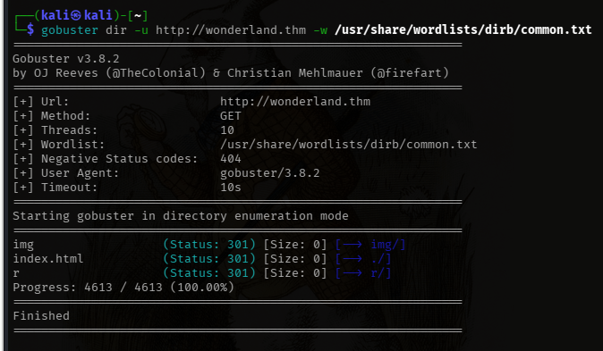
</a>
  
**Figure 2:** found one interesting directory <b>r</b>.

Again nothing interesting was found in the <b>r</b> directory. So i again used <b>gobuster</b> to further enumerate directory

<a href="images/03.png">
 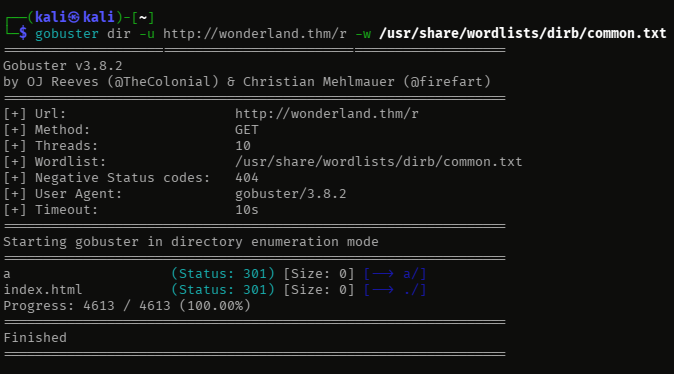
</a>
  
**Figure 3:** Found another directory inside <b>r</b>.

I repeated the process using <b>gobuster</b> and finally found something interesing.

<a href="images/05.png">
 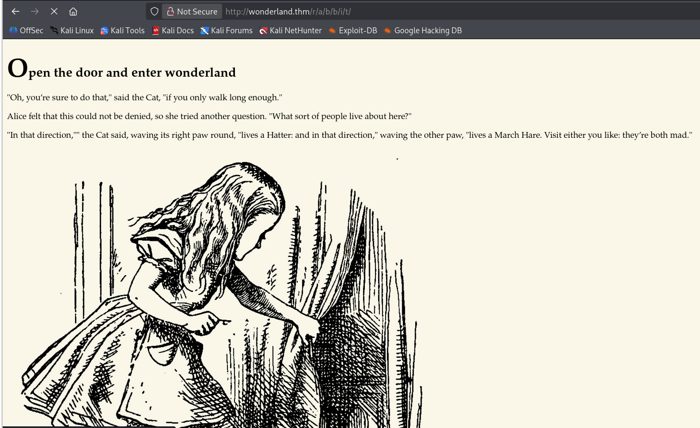
</a>
  
**Figure 4:** Directory /r/a/b/b/i/t.

This is the webpage for directory /r/a/b/b/i/t

Upon viewing its page source we can see the credentials for alice user

<a href="images/06.png">
 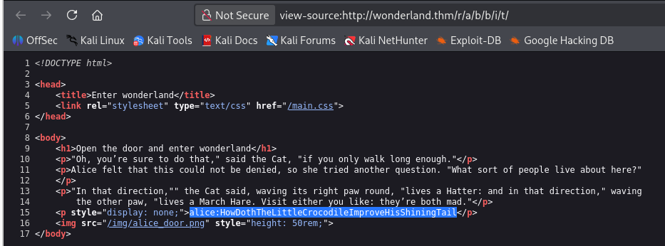
</a>
  
**Figure 5:** Found <b>alice</a> credentials.

Now next step is to try log into ssh using alice creds

<a href="images/07.png">
 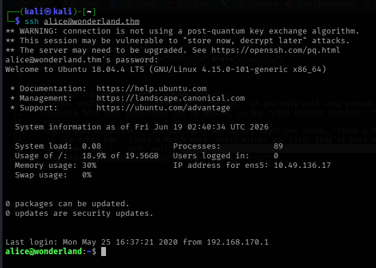
</a>
  
**Figure 6:** Logged In as alice.

I viewed every files and folders, but user.txt was nowhere to be found so I just thought maybe we can find user.txt file inside root folder and I was absolutely right

<a href="images/08.png">
 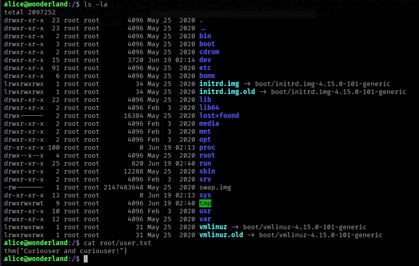
</a>
  
**Figure 7:** Found user.txt.

Now its time for Privilege Escalation. The first command that I always use for privilege escalation is <b>sudo -l</b>

Below image shows that we can actually use sudo as rabbit user which is really a good starting point for us.

<a href="images/11.png">
 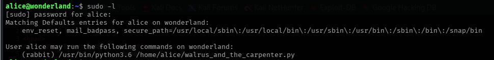
</a>
  
**Figure 8:** .

Next, I found python file which is using random library upon its execution. So we need to create a new file and name it random.py and add our payload inside it.

<a href="images/09.png">
 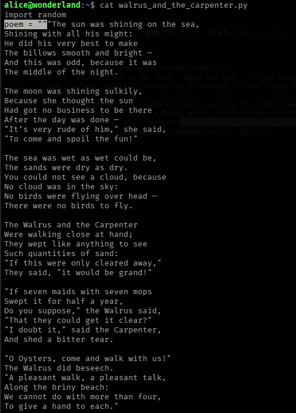
</a>
  
**Figure 9:** Inspecting python file inside alice folder.

<a href="images/12.png">
 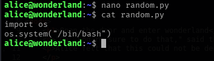
</a>
  
**Figure 10:**

<a href="images/13.png">
 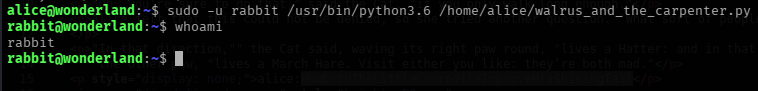
</a>
  
**Figure 11:** LoggedIn as rabbit user

Next step is to Priv Esc into different user until we get root user

Here we can see a <b>SUID</b>binaryfile <b>teaParty</b> 

<a href="images/14.png">
 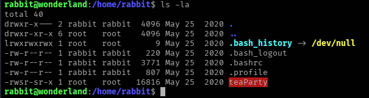
</a>
  
**Figure 12:** SUID binary teaParty

when executing <b>teaParty</b> binary we get Segmentation fault. Now we use HTTP server to grab the binary into our machine

  

<a href="images/17.png">
 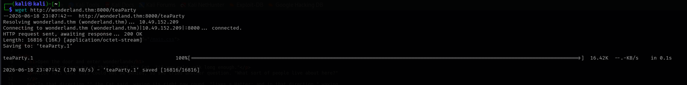
</a>  

Now we use <b>strings</b> cmd to find human readable text from teaParty binary

<a href="images/18.png">
 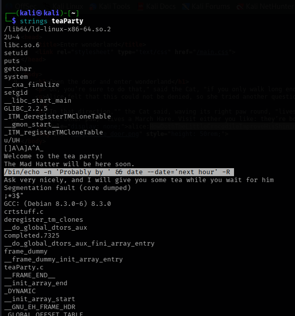
</a>
  
**Figure:** Using Strings cmd

Wow found an interesting line which is highlighted in the above image. We can see <b>date</b> is being executed without absolute path. So we create a new file <b>date</b>, add our payload inside, make it executable and add that file into PATH

<a href="images/19.png">
 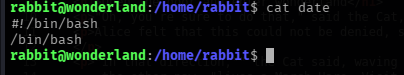
</a>
  
**Figure:** created file "date" and added our payload inside for Priv Esc

<a href="images/20.png">
 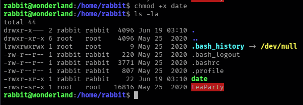
</a>
  
**Figure:** making it executable

<a href="images/21.png">
 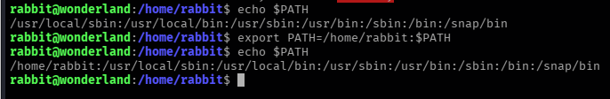
</a>
  
**Figure:** adding it into PATH

Now we execute <b>teaParty</b> binary and as we can see we are now logged in as <b>hatter</b>

<a href="images/22.png">
 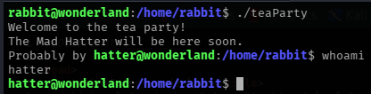
</a>
  
**Figure:** LoggedIn as hatter

found password.txt file that contains password for hatter. Now we can directly logIn as hatter using SSH.

<a href="images/23.png">
 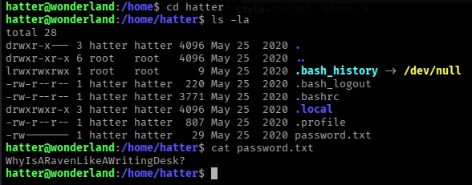
</a>
  
**Figure:** found hatter password

Now our final goal is to logIn as root user and find root flag.

I looked into every folder , took a while to find next privilege escalation step. After looking out some ways to gain root access i found <b>capabilites</b> as my next step into getting root access

<a href="images/25.png">
 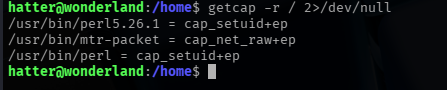
</a>
  
**Figure:** 

I used <a href="https://gtfobins.org/gtfobins/perl/#capabilities">GTFObins</a> website to exploit this capabilities

and here m loggedIn as root user

<a href="images/26.png">
 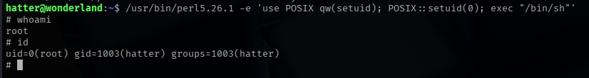
</a>
  
**Figure:** loggedIn as root user

